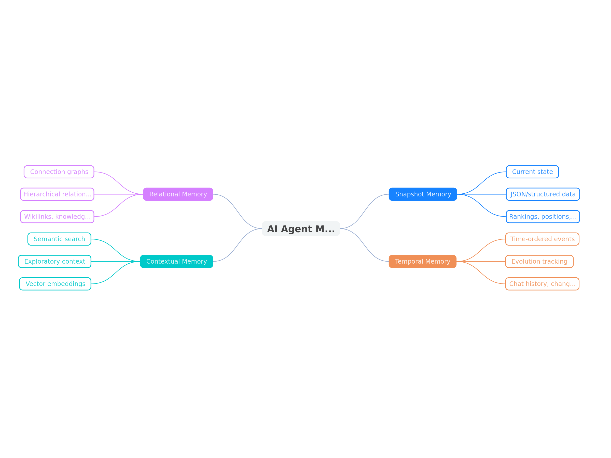
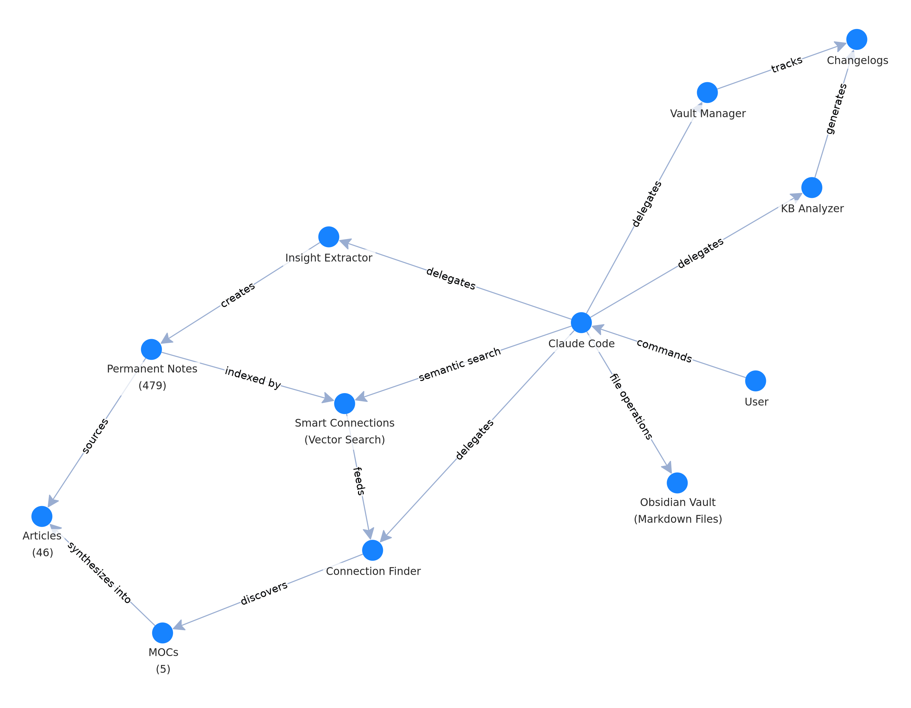
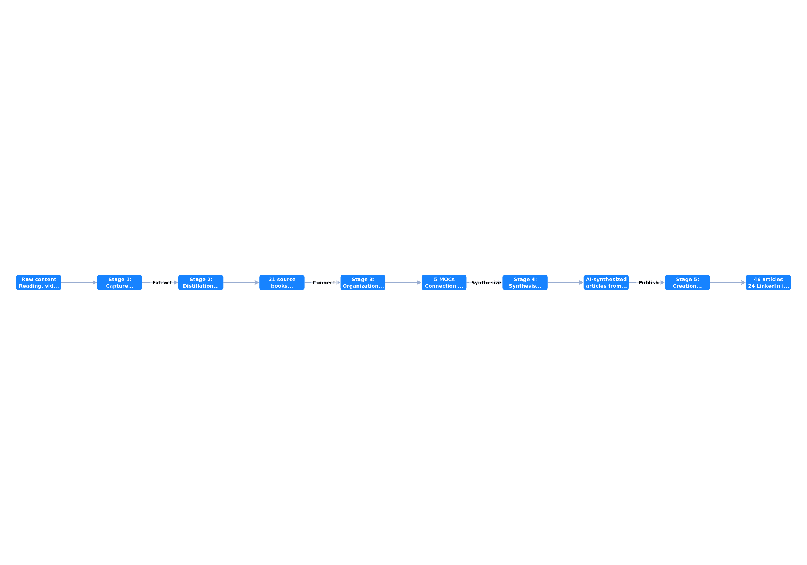

# Building a Second Brain with AI Agents: How Claude Code Transformed My Zettelkasten from Tedious Chore to Active Knowledge Engine

## TL;DR

**You will learn:**
- Why traditional Zettelkasten methods fail despite their power
- How AI agents can transform manual knowledge management into an automated insight engine
- The technical architecture connecting Claude Code + Obsidian + Smart Connections
- Four types of memory every AI agent needs (and how they apply to your second brain)
- Practical strategies for context management that prevent performance degradation
- How to extract and connect insights from years of content automatically

**The Bottom Line**: A second brain powered by AI agents isn't just faster—it fundamentally changes what's possible. My system now automatically extracts insights from content, discovers hidden connections between ideas, and synthesizes original articles based on my accumulated knowledge. This isn't about AI replacing thinking; it's about AI amplifying your intellectual infrastructure.

---

## The Problem: Zettelkasten Fatigue

I've been fascinated by the Zettelkasten method for years. If you're not familiar, it's a knowledge management system developed by Niklas Luhmann, a German sociologist who published over 70 books and 400 scholarly articles using nothing but index cards and a carefully structured filing system.

The method is brilliant in theory:
1. Capture atomic insights from everything you read
2. Connect related ideas across different sources
3. Build a web of knowledge where hidden connections reveal unique insights
4. Leverage this network to generate original content

The reality? **It's brutally tedious.**

For years, I followed this practice religiously using Obsidian. I'd read books, watch videos, consume articles—and then spend hours manually:
- Extracting key insights into individual notes
- Formatting them correctly
- Adding source attribution
- Searching for connections to existing notes
- Building link structures between related concepts

Eventually, I got bored and stopped. The intellectual payoff was real, but the manual overhead was crushing. My knowledge base stagnated with 400+ permanent notes collecting digital dust.

Then AI agents changed everything.

---

## The Breakthrough: From Tool to Infrastructure

Here's what shifted my thinking: I stopped viewing Claude Code as a coding assistant and started treating it as the operating system for my knowledge base.

This required three fundamental changes:

### Change 1: Launch Claude Inside the Knowledge Base

Obsidian stores everything as plain markdown files in folders. Instead of treating this as a "vault" to protect, I launched Claude Code directly in my Obsidian workspace directory.

**Why this matters**: Claude can now manipulate files directly using standard file operations. No API limitations. No synchronization headaches. The knowledge base is just a file system, and Claude has native access.

### Change 2: Connect Semantic Search Through Smart Connections

I integrated the Smart Connections plugin for Obsidian, which vectorizes your entire knowledge base. This gives Claude the ability to:
- Search by semantic similarity (not just keywords)
- Pull connected notes based on relationships
- Find non-obvious connections between concepts

Research from Sun Yat-sen University and Carnegie Mellon University confirms what many builders have discovered: vector search excels at finding shared meaning and unexpected connections that keyword search misses entirely.

**Think about it this way**: Vector search is like shining a light on a map. Your notes are pins scattered across a landscape. When you search, you illuminate an area and capture all pins within the light's radius. Some pins outside the light get missed, but you discover proximity relationships you never knew existed.

### Change 3: Design for the Context Window Constraint

Here's a foundational principle I've learned from building production AI agents:

**All memory ultimately becomes text in context window.**

No matter how sophisticated your database structure or clever your retrieval mechanism, everything you store and retrieve gets inserted into the prompt sent to your language model. This constraint shapes every architectural decision.

Your context window has a fixed size. You must balance:
- Speed of querying and retrieving memory
- Importance of the information retrieved
- Volume of memory without overwhelming the model
- Cost in tokens for each request

More context isn't always better. Research shows that overloading the context window leads to:
- Slower responses and higher costs
- Model confusion (cognitive overload for LLMs)
- Decreased performance despite "more memory"

**The solution**: Be selective. Retrieve summaries, not full history. Give the agent tools to fetch detail when needed.

---

## The Architecture: Four Types of Memory for Knowledge Management

When designing memory for an AI agent, you need to think about what aspect of reality you want to represent. Based on my research building production agents, I've identified four fundamental memory types:

### 1. Snapshot Memory: Current State

This represents the "right now" photograph of your knowledge base.

**In my system:**
- Current knowledge base statistics (479 permanent notes, 31 source books)
- Active MOCs (Maps of Content) and their structure
- Recent session state and workflow position

**Storage**: JSON files and structured markdown (knowledge-base-analysis.md)

### 2. Temporal Memory: How Things Changed

This captures time-ordered events showing evolution.

**In my system:**
- Changelogs documenting each AI-assisted session
- Version history of framework development
- Evolution of thinking on specific topics over years

**Storage**: Dated changelog files in `/05-Meta/Changelogs/`

### 3. Relational Memory: Connection Graphs

This represents relationships between concepts.

**In my system:**
- Wikilinks connecting permanent notes
- MOCs organizing thematic clusters
- Connection maps showing network topology
- Smart Connections semantic similarity scores

**Storage**: Markdown links + vectorized embeddings

### 4. Contextual Memory: Exploratory Context

This provides broadly relevant but imprecise information through semantic search.

**In my system:**
- Smart Connections searches for related insights
- Three-layer connection pulling (note → connected notes → second-degree connections → third-degree)
- Similarity-based article synthesis

**Storage**: Vector embeddings via Smart Connections plugin

**The key insight**: You don't need all four types in every system. Choose what makes sense for your use case. My knowledge management system heavily emphasizes relational and contextual memory because **discovering unexpected connections** is the primary value proposition.

*Figure 1: The Four-Type Memory Framework showing how different memory types represent different aspects of reality*

---

## The Implementation: Specialized Sub-Agents

I designed Claude Code not as a monolithic assistant but as an orchestration layer for specialized sub-agents. Each has a specific responsibility:

### Insight Extractor Agent
- Takes my published articles, LinkedIn posts, and blog content
- Analyzes for unique perspectives and original thinking
- Searches knowledge base for duplicates
- Creates new permanent notes for genuinely novel insights
- Maintains source attribution

**Why this matters**: I had years of content scattered across platforms. This agent transformed it from published work into permanent knowledge base entries—automatically.

### Connection Finder Agent
- Reviews the permanent note collection systematically
- Identifies hidden connections between concepts
- Creates explicit connection maps documenting network topology
- Surfaces consilience zones where independent domains converge

**Example discovery**: The agent found that "confirmation bias creates dopamine spikes" serves as a master bridge connecting neuroscience ↔ identity formation ↔ decision-making ↔ social media polarization. I had notes on all these topics but never explicitly connected them until the agent did.

### Knowledge Base Analyzer
- Generates comprehensive structural analysis of the entire vault
- Documents thematic clusters and hub nodes
- Identifies knowledge gaps and growth opportunities
- Creates network topology maps

**The output**: A 2,000-line knowledge-base-analysis.md file that loads into Claude's context on startup, giving it immediate understanding of the entire intellectual landscape.

### Vault Manager
- CRUD operations on notes
- Maintains organizational standards
- Ensures proper formatting and attribution
- Tracks changes in separate changelog files

*Figure 2: System architecture showing how Claude Code orchestrates specialized sub-agents, interfaces with Obsidian vault and Smart Connections, and produces outputs*

---

## The Workflow: From Capture to Creation

Here's how the system works in practice:

### Stage 1: Capture (Inbox)
- Quick captures from reading, conversations, videos
- Raw content extractions awaiting processing
- Everything starts here

### Stage 2: Distillation (Sources → Permanent Notes)
- Book notes with comprehensive insights (31 books processed)
- Insight Extractor agent analyzes source material
- Atomic insights extracted as permanent notes (479 and growing)
- Each note: one idea, clear attribution, 13 lines average

### Stage 3: Organization (MOCs)
- Maps of Content provide thematic navigation
- Five major MOCs: Buddhism & Consciousness, Dopamine Systems, Identity & Beliefs, Decision-Making, Master Navigation
- Connection Finder runs on schedule to discover hidden links

### Stage 4: Synthesis (Articles)
- Claude searches knowledge base for relevant permanent notes
- Pulls three layers of connections for comprehensive context
- Synthesizes original articles based on my accumulated insights
- Not generic AI content—synthesis of my unique perspectives

### Stage 5: Creation (Output)
- 46 published articles synthesized from permanent notes
- 24 LinkedIn insights extracted and stored
- 6 original frameworks documented
- Growing corpus of connected knowledge

*Figure 3: The five-stage knowledge workflow from raw capture through distillation, organization, synthesis, to published creation*

---

## The Results: From Static Archive to Active Engine

**What changed:**

**Before AI agents:**
- Manual note creation: ~30-45 minutes per book chapter
- Connection discovery: Occasional, when I happened to notice
- Content creation: Starting from scratch each time
- Knowledge base growth: Sporadic, motivation-dependent

**After AI agents:**
- Automatic insight extraction from existing content
- Scheduled connection discovery runs (daily or on-demand)
- Article synthesis from accumulated knowledge in minutes
- Continuous knowledge base growth: 400→479 notes, systematic tracking

**The qualitative shift**: My knowledge base transformed from a **reference library** into an **active knowledge creation engine**.

I now use it to:
- Brainstorm new article ideas by exploring connection maps
- Synthesize insights across years of reading
- Discover non-obvious relationships between concepts
- Generate content grounded in my unique perspective, not generic AI output
- Track the evolution of my thinking over time

**The intellectual payoff**: I recently had the system create an article on "Spiritual Life in the Age of AI." I had no explicit notes on this topic. But Claude pulled from my Buddhist philosophy notes, neuroscience insights, flow state research, and AI agent frameworks—and synthesized something genuinely novel by combining my existing mental models in new ways.

That's the power of a connected knowledge base with AI orchestration.

---

## Key Lessons: What Makes This Work

### 1. External Systems as Memory Interfaces

Don't duplicate what already exists elsewhere. Your calendar, email, and CRM are excellent memory sources.

Treat external APIs as memory interfaces. The agent queries them when needed rather than copying everything into your database.

**Problems with duplication:**
- Sync complexity and lag
- Stale data issues
- Maintenance overhead
- Source of truth confusion

**Benefits of API-as-memory:**
- Always current data
- No sync logic required
- Reduced storage
- Single source of truth

### 2. Context Window Management

Strategic retrieval beats comprehensive inclusion.

**Instead of loading everything:**
- Provide summaries rather than full details
- Give agent tools to request more information
- Design for token budget: System instructions (~500) + User message (~100-500) = Memory overhead remaining
- Include only most recent 5-10 interactions by default

Like humans, LLMs struggle when overwhelmed. Less but better-selected context outperforms comprehensive but unfocused memory.

### 3. Constraints Enable Better Design

The context window limitation isn't a bug—it's a feature that forces better architectural decisions.

**The art of memory design** is deciding:
- What information to retrieve
- How much to include
- How to structure it for optimal performance

This applies equally to AI agents and human knowledge management.

### 4. Voice Preservation Matters

The system explicitly prioritizes my unique insights over generic knowledge.

From my system prompt:
> "I told it explicitly to not contribute too much unless asked, because that's not helpful when it starts hallucinating. I want it to be a collection of my unique ideas, thoughts, and insights—not AI's ideas."

**The result**: When I generate articles, they reflect my thinking patterns, my frameworks, my contrarian perspectives—amplified by AI, not replaced by it.

---

## Implementation: The Template

I've created a GitHub repository with the template project structure for this approach. It includes:

- CLAUDE.md system prompt with Zettelkasten methodology
- Sub-agent configurations for each specialized role
- MCP server setup for Smart Connections integration
- Workflow documentation and best practices
- Example knowledge base structure

You can find it in the description below.

---

## The Future: Headless Mode and Beyond

Next steps I'm working on:

**Headless Claude Code integration**: Remote access to the system so I can save insights from my phone's messenger or notes app directly into the knowledge base.

**Scheduled automation**: Connection Finder runs daily to discover new relationships while I sleep.

**Multi-modal integration**: Process video transcripts, podcast notes, and handwritten notes through the same pipeline.

**Collaborative knowledge graphs**: Connecting my knowledge base with others who have complementary expertise.

---

## Summary: Why This Matters

The Zettelkasten method works. The intellectual payoff is massive. But the manual overhead killed adoption for most people, including me.

AI agents don't just automate the tedious parts—they unlock capabilities impossible with manual approaches:

1. **Automatic insight extraction** from years of content
2. **Systematic connection discovery** across hundreds of notes
3. **Multi-layer context pulling** for comprehensive synthesis
4. **Voice-preserving content generation** from accumulated knowledge
5. **Evolution tracking** documenting intellectual development

This isn't about replacing thinking with AI. It's about building intellectual infrastructure that amplifies your unique insights and makes them accessible and combinable in ways that were previously impossible.

My second brain is no longer a static archive. It's an active partner in knowledge creation.

---

## What's Your Experience?

Are you using second brain approaches? Have you experimented with AI-assisted knowledge management? What insights have I missed?

Leave a comment below and let me know. And if you found this useful, subscribe—my AI agent tells me I have low engagement on my content, and apparently that matters.

---

**Research References:**
- Four-Type Memory Framework for AI Agents (Original Framework, 2025)
- Understanding Memory Architecture for AI Agents (YourWay Substack, 2025)
- Smart Connections: Semantic Search for Obsidian (Community Plugin)
- Sun Yat-sen University & Carnegie Mellon University: Vector Search Research
- Niklas Luhmann: Zettelkasten Methodology

**Repository**: [Link to be added in description]

---

*This article was created using the exact system it describes—synthesizing insights from 479 permanent notes, pulling three layers of connections, and incorporating frameworks developed over years of knowledge work. The irony is not lost on me.*
