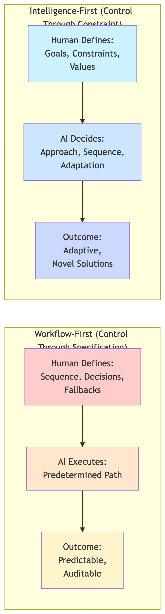
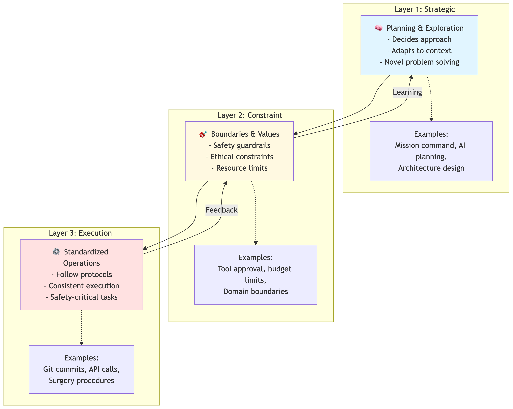
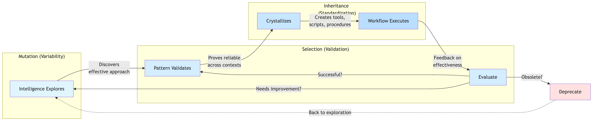
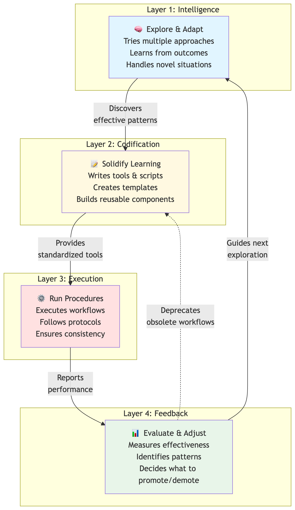
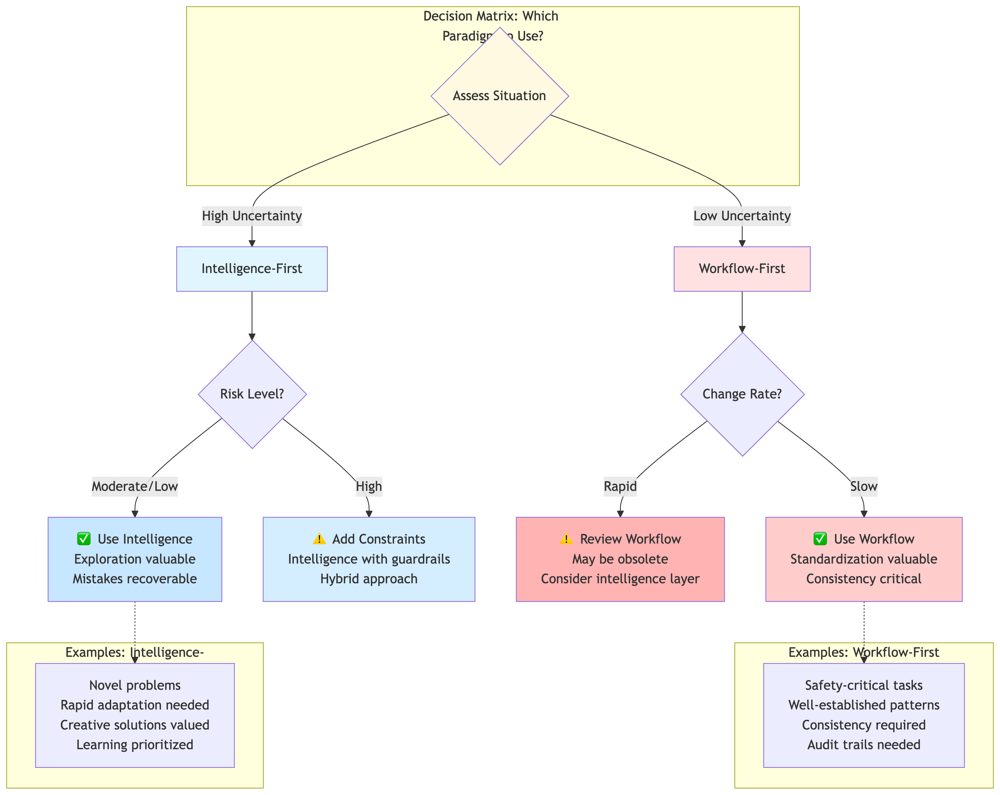

# Who Should Decide How AI Agents Decide?

**The Hidden Architecture Choice That Shapes Everything**

---

There's a question hiding beneath every conversation about "agentic AI frameworks" that most people miss. It's not about which tools to use or which library has the best features. It's about something far more fundamental:

**Who decides how the AI agent decides?**

This question reveals two radically different paradigms for building AI systems—paradigms that reflect different beliefs about intelligence, control, and trust. Understanding this choice is like discovering that chess and Go aren't just different games; they're different philosophies of strategy made manifest.

Let me show you what I mean.

---

## Two Ways to Build an AI Agent

### The GPS Navigator (Workflow-First)

Imagine you're planning a road trip from San Francisco to New York. You sit down and meticulously plan every turn:

- Take Highway 101 South for 3.2 miles
- Merge onto I-280 East
- Take exit 57B toward I-80 East
- Continue for 2,847 miles...

You've created a **workflow**. Every decision point is predetermined. The driver (or AI) just executes your plan. If there's a detour? Too bad—the plan didn't account for that.

This is **workflow-first AI architecture**. You, the human, design the algorithm. The AI follows it.

**Examples:** Most current "agentic frameworks" like LangGraph, CrewAI with predefined workflows, traditional software with AI components.

### The Expedition Leader (Intelligence-First)

Now imagine a different approach. Instead of planning every turn, you tell an experienced expedition leader:

"Get us from San Francisco to New York. Avoid toll roads. We need to arrive by Friday. Stay safe."

You've defined the **constraints and goals**, but the expedition leader decides:
- Which route to take
- When to take detours
- Where to stop for the night
- How to adapt to weather
- When to change strategy

This is **intelligence-first AI architecture**. You define what matters (goals, constraints, values). The AI decides how to achieve it.

**Examples:** Claude Code, Devin, autonomous CLI agents that figure out their own approach.

---

## Why This Difference Matters More Than You Think

These aren't just two ways to build the same thing. They're **two different beliefs about where intelligence should live**.

### Workflow-First Believes:

- **Humans are better strategists** than AI (for now)
- **Predictability matters more than optimality**—better to be consistently okay than surprisingly great
- **Failure modes should be designed, not discovered**—we should anticipate problems
- **Trust requires transparency**—I trust it because I can audit every step

### Intelligence-First Believes:

- **AI can discover better approaches** than humans can pre-specify
- **Adaptability matters more than predictability**—the world changes too fast for fixed plans
- **Emergence is valuable**—let the system surprise us with novel solutions
- **Trust through alignment**—I trust it because its goals align with mine

Look familiar? This same tension appears everywhere:

- **Military:** Detailed battle plans → Mission command ("take that hill, I don't care how")
- **Parenting:** "Do your homework at 4pm" → "Learning is important, figure out when works best"
- **Organizations:** Micromanagement → OKRs (outcomes, not tactics)
- **Physics:** Newtonian certainty → Quantum probability

**The pattern:** We keep discovering that defining *why* scales better than specifying *how*.

---

## The Real Question: Control or Constraint?

Here's where it gets interesting. The debate isn't really about technology—it's about **epistemology**. It's about what we believe we can know and control.

**Workflow-first asks:** "Can I anticipate all the scenarios?"

**Intelligence-first asks:** "Can I define what success looks like?"

Think about raising a child. You can't script every interaction they'll have (workflow). But you can teach them values and principles (intelligence). The question is: which produces better judgment in novel situations?



---

## But Wait—We Need BOTH

Here's the twist: **The answer isn't either/or**. Every effective system needs both paradigms—just at different layers.

Think about surgery:

- **Before the operation** (strategic layer): The surgeon uses **intelligence-first thinking**. They assess the patient, consider complications, adapt their approach. Every patient is different. Rigid protocols would fail.

- **During critical moments** (execution layer): The surgeon follows **workflow-first protocols**. When you're clamping an artery, you don't improvise. You follow the exact procedure every time. Creativity kills patients.

**Different layers need different paradigms:**

| Layer | Characteristics | Use This |
|-------|----------------|----------|
| **Strategic** | High uncertainty, novel situations, rapid change | Intelligence-First |
| **Execution** | Known patterns, high risk, stable environment | Workflow-First |



### What Happens When You Get This Wrong

**Micromanaging Strategy** (workflow at the wrong layer):
- Military commanders specifying every soldier's movement → Can't adapt to battlefield changes
- Executives defining every employee workflow → Innovation dies
- AI planner using rigid scripts → Fails on novel problems

**Improvising Critical Operations** (intelligence at the wrong layer):
- Surgeons "winging it" during routine procedures → Unnecessary risk
- Power plants treating safety protocols as "guidelines" → Disasters
- AI making creative choices during data deletion → Oops, there goes production

---

## The Hidden Evolutionary Pattern

Here's the part that blew my mind when I saw it:

**Intelligence-first systems don't replace workflow-first systems. They generate them.**

Watch what happens:

1. **Intelligence layer explores** → Tries different approaches to a problem
2. **Pattern emerges** → "Approach X works really well for situation Y"
3. **Gets codified** → Creates a tool, script, or procedure (workflow-first component)
4. **Intelligence moves on** → Explores the next uncertainty

It's **evolutionary**:
- **Intelligence = mutation** (exploration, variability, creativity)
- **Workflow = genes** (standardization, reliability, efficiency)



### This Pattern Is Everywhere

**In medicine:**
- Doctors experiment with treatments → Effective ones become protocols
- Research phase (intelligence) → Standard of care (workflow)

**In software:**
- Engineers try different solutions → Best patterns become libraries
- Exploration phase (intelligence) → Framework/tool (workflow)

**In AI systems:**
- Agent tries multiple approaches → Generates reusable scripts
- Learning phase (intelligence) → Automation (workflow)

**The insight:** Intelligence crystallizes experience into procedures. Without intelligence, workflows become stale. Without workflows, intelligence wastes energy re-solving the same problems.

---

## Why AI Agents That Can't Code Are Handicapped

This reveals why the most capable AI agents need to write code:

**They can't crystallize their learning without it.**

An AI agent that discovers a better approach but can't codify it is like a scientist who makes a breakthrough but can't write it down. The knowledge dies with that conversation.

**Full-capability agents need four layers:**

1. **Intelligence layer:** Explore, experiment, adapt
2. **Codification layer:** Write tools, scripts, configs (solidify learning)
3. **Execution layer:** Run standardized workflows (use solid knowledge)
4. **Feedback layer:** Evaluate what to promote/demote (continuous evolution)



---

## The Fractal Pattern

Here's where it gets trippy: **This pattern repeats at every scale**.

- **Individual agent:** Learns → Creates personal tools
- **Team of agents:** Coordinates → Develops shared protocols
- **Organization:** Experiments → Establishes best practices
- **Industry:** Competes → Standards emerge

It's fractals all the way down—and all the way up.

The question "intelligence-first or workflow-first?" appears at each level:
- Within an agent (planning vs execution)
- Between agents (coordination vs protocol)
- Across organizations (innovation vs standardization)

---

## Practical Implications: How to Choose

So how do you decide which paradigm to use? Here's a simple decision tree:

**Use Intelligence-First when:**
- ✅ Problem is novel or rapidly changing
- ✅ No established best practice exists
- ✅ Creativity/adaptation is valuable
- ✅ Mistakes are recoverable
- ✅ You want the system to learn

**Use Workflow-First when:**
- ✅ Problem is well-understood and stable
- ✅ Best practices are established
- ✅ Consistency is critical
- ✅ Mistakes are catastrophic
- ✅ You want predictability

**The synthesis:**
- Use intelligence-first at the strategic layer (planning, exploration)
- Use workflow-first at the execution layer (safety, critical operations)
- Create mechanisms for intelligence to promote patterns into workflows
- Create mechanisms for workflows to be deprecated when obsolete



---

## The Deeper Pattern: From HOW to WHY

There's something profound happening across multiple domains simultaneously:

**We're shifting from controlling HOW to defining WHY.**

- **Organizations:** Task lists → OKRs (outcomes not methods)
- **Military:** Detailed orders → Commander's intent
- **AI:** Prompt engineering → Context engineering
- **Parenting:** "Do this" → "This is what matters"

**Why does this keep happening?**

Because **specifying HOW doesn't scale in complexity**. The number of scenarios explodes. The environment changes too fast. Novel situations constantly emerge.

But **defining WHY scales beautifully**. Values, principles, and goals are compression algorithms for behavior. They work across contexts you never imagined.

Intelligence-first architecture is this pattern applied to AI systems.

---

## What This Means for the Future

We're not just building AI agents. We're deciding **what kind of intelligence we want to create**.

**Workflow-first agents** will be:
- Predictable, auditable, safe
- Excellent at known tasks
- Limited by our imagination
- Tools in human-designed machines

**Intelligence-first agents** will be:
- Adaptive, surprising, autonomous
- Excellent at novel challenges
- Limited by their alignment
- Partners in collaborative intelligence

**The future probably needs both:**
- Intelligence-first agents exploring new frontiers
- Crystallizing their discoveries into workflow-first components
- Creating a continuously evolving architecture
- Where human values constrain, but don't dictate, AI decisions

---

## The Question We're Really Asking

"Who should decide how AI agents decide?" isn't a technical question.

It's a question about:
- **Trust:** Do we trust AI judgment?
- **Control:** How much should we specify?
- **Intelligence:** Where should it live?
- **Evolution:** Can systems improve themselves?

The answer shapes not just our AI architectures, but our relationship with artificial intelligence.

**We're not choosing between two frameworks.**

**We're choosing between two futures.**

One where we remain the architects, meticulously designing every decision.

Another where we become the constraints, defining what matters and letting intelligence—artificial and human—figure out the rest.

The interesting part? We probably need both. Intelligence to explore. Workflows to scale. Each generating the other in an endless evolutionary dance.

---

## Part 2: The Practical Framework

So far we've explored the philosophical distinction. Now let's make it actionable.

### Intelligence Points: A New Way to See Systems

Here's a realization that changes everything:

**Any system is just a sequence of workflow executions punctuated by discrete intelligence points—moments where judgment happens.**

Think of it like a river (workflow) with rocks (intelligence points) where water decides which direction to flow.

Even that N8N automation you built? It has intelligence points:
```
[N8N workflow runs] → [Hits agent node] (INTELLIGENCE POINT)
    → [Agent chooses tool] (INTELLIGENCE POINT)
    → [Tool executes] → [Next decision...]
```

**The realization:** Even "workflow-first" systems have intelligence points. Even "intelligence-first" agents execute workflows between decisions.

---

## The Intelligence Point Audit Framework

Instead of asking "Should we use agents or workflows?", ask:

**"Where do we need intelligence points in this process?"**

Here's how:

### Step 1: Map Your Process

Write it as a sequence (don't worry about agents vs automation yet):

**Example: Customer Support**
1. Ticket arrives
2. Route to category
3. Gather required info
4. Attempt solution
5. Verify resolution

### Step 2: Score Each Step (1-10)

| Dimension | What It Measures |
|-----------|-----------------|
| **Uncertainty** | How predictable is this step? |
| **Judgment** | How much nuanced evaluation needed? |
| **Cost of Error** | How bad if this fails? |
| **Volume** | How often does this happen? |

### Step 3: Apply Decision Rules

**Place Intelligence Point (Agent) when:**
- Uncertainty ≥ 7 OR Judgment ≥ 8
- AND Cost of Error ≥ 6

**Use Workflow (Automation) when:**
- Uncertainty ≤ 4 AND Judgment ≤ 5
- OR Volume ≥ 8

**Use Hybrid (learns → becomes workflow) when:**
- Currently needs judgment BUT patterns are emerging

### Step 4: Design Your System

**Customer Support Example:**

| Step | Unc | Jdg | Cost | Vol | Decision |
|------|-----|-----|------|-----|----------|
| 1. Arrive | 1 | 1 | 1 | 10 | Workflow |
| 2. Route | 6 | 7 | 8 | 10 | **INTELLIGENCE POINT** |
| 3. Gather | 3 | 4 | 3 | 10 | Workflow |
| 4. Solution | 7 | 8 | 9 | 8 | **INTELLIGENCE POINT** |
| 5. Verify | 5 | 6 | 7 | 10 | **HYBRID** (→ automate) |

**Your system emerges:**

```
[Auto-capture ticket]
    ↓
INTELLIGENCE: Route to right team (Agent)
    ↓
[Gather info workflow]
    ↓
INTELLIGENCE: Diagnose & solve (Agent)
    ↓
INTELLIGENCE: Verify (Agent that learns → automated checks)
```

**Result:** 3 intelligence points in a 5-step process.

---

## The Key Questions This Answers

✅ **"Should we automate this?"** → Check the scores
✅ **"Do we need AI here?"** → High uncertainty + judgment = yes
✅ **"Can this become workflow later?"** → Hybrid approach
✅ **"Where's the ROI?"** → High volume + low judgment = wins
✅ **"What's the risk?"** → High cost of error = add safeguards

---

## Architecture as Density

Here's the deeper insight:

**Intelligence-first vs workflow-first isn't binary—it's a spectrum defined by intelligence point density.**

```
Density = Intelligence Points / Total Steps

High density (every 2-3 steps) = Intelligence-first system
Low density (every 20+ steps) = Workflow-first system
Variable density = Optimal hybrid (most real systems)
```

**The design question becomes:**

"What's the minimum intelligence point density needed to handle uncertainty within our cost/latency constraints?"

**Why minimize?**
- Intelligence is expensive (API costs)
- Intelligence is slow (latency)
- Intelligence is unpredictable (variance)

**Workflow is:**
- Cheap (deterministic code)
- Fast (no API calls)
- Predictable (same input → same output)

---

## Dynamic Density Over Time

**Systems evolve:**

**Early:** High density (agents explore, discover patterns)
**Middle:** Decreasing density (patterns crystallize into workflows)
**Mature:** Low density (optimized for speed/cost)
**Environment changes:** Density increases again

**Design implication:** Build systems that can adjust density—add intelligence points when uncertainty increases, remove them when patterns crystallize.

---

## Conclusion: The Synthesis

The debate between intelligence-first and workflow-first architectures reveals something deeper: **different layers of any complex system need different control paradigms**.

- **Strategic layers need intelligence** (exploration, adaptation, learning)
- **Execution layers need workflows** (consistency, safety, efficiency)
- **Intelligence should crystallize into workflows** (capture learnings)
- **Workflows should be deprecated when obsolete** (prevent technical debt)

This isn't just about AI agents. It's a universal pattern that appears in military strategy, organizational design, software architecture, and human development.

**The key insights:**

1. The question isn't "Which paradigm?" but "Which paradigm at which layer?"
2. Systems are sequences of workflows punctuated by intelligence points
3. Architecture is defined by intelligence point density
4. Optimal density changes over time as systems learn

Build systems that know when to think and when to follow the script. Use the Intelligence Point Audit Framework to decide where intelligence lives.

---

**Want to explore more?** This framework connects to broader patterns in decision-making, organizational design, and the evolution of intelligence itself. The rabbit hole goes deep.

[End]

---

*Charts generated with Mermaid diagrams. All visualizations created 2025-11-12.*
