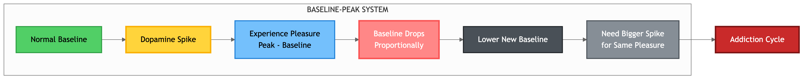
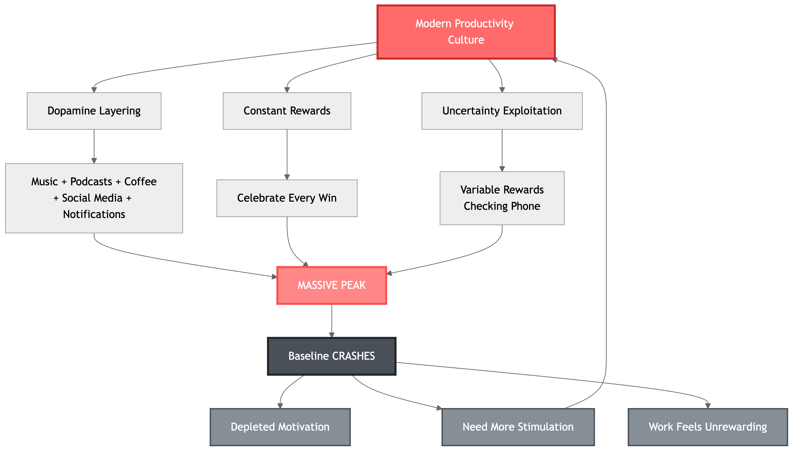
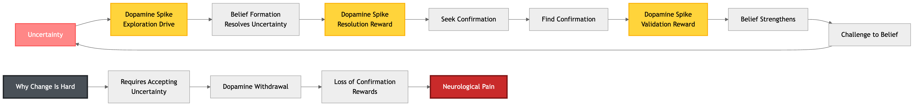
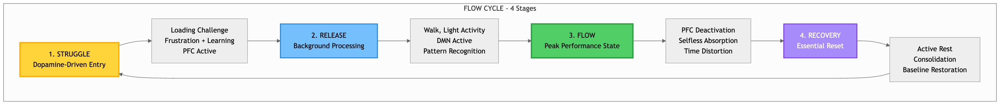
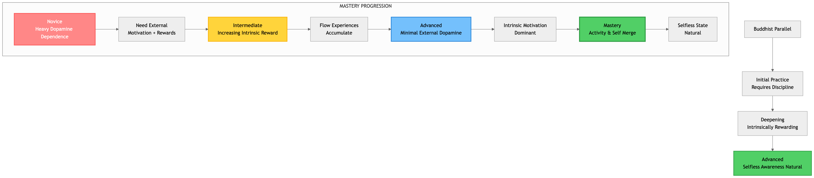

# The Dopamine Paradox: Why Your Productivity System Is Sabotaging You

*How understanding dopamine cycles can transform your approach to deep work and sustainable high performance*

---

You sit down to work on your most important project. Music plays in the background. A podcast keeps you company. Your phone buzzes with notifications—each one a tiny hit of validation. You check your to-do list and cross off another small task, feeling that satisfying rush of accomplishment.

You're being productive, right?

Wrong. You're systematically destroying your brain's capacity for sustained motivation.

The culprit? A misunderstanding of how dopamine—the neurotransmitter that drives all human motivation—actually works. And this misunderstanding is at the heart of why modern productivity culture often makes us less productive, not more.

## The Baseline-Peak Trap: Why Pleasure Isn't What You Think

Here's what most people get wrong about dopamine: it's not a "pleasure chemical." It's a **motivation molecule** that dictates your level of desire and willingness to go through effort.

The breakthrough insight comes from understanding how dopamine actually operates in your brain. Dopamine works on a **baseline-peak system**:

- Your brain maintains a baseline level of dopamine
- When you experience something rewarding, you get a spike (peak) above that baseline
- **The pleasure you experience isn't from the absolute height of the peak—it's from the difference between the peak and your baseline**

Here's where it gets critical: **after every dopamine peak, your baseline drops proportionally to the height of that peak**.

Think of it like a credit card for motivation. Every peak borrows from your future baseline. The bigger the spike, the bigger the crash.

This is why:
- The second cookie isn't as satisfying as the first
- Checking social media during breaks leaves you more drained than before
- Celebrating every small win eventually makes you unable to feel motivated at all

Your body is trying to maintain dopamine homeostasis, but modern life—and especially modern productivity culture—keeps forcing massive spikes that progressively deplete your baseline.

*Figure 1: The Baseline-Peak Dopamine System - How every spike borrows from your future motivation*

## How We Sabotage Our Own Productivity

### The Layering Problem

One of the most destructive patterns in modern work culture is **dopamine layering**—stacking multiple dopamine sources simultaneously.

You're not just working. You're:
- Working while listening to music
- With a podcast in the background
- Checking notifications every few minutes
- Sipping on your third coffee
- Scrolling social media during "micro-breaks"

Each of these creates its own dopamine spike. Stack them together, and you get a massive peak. Your brain floods with dopamine. It feels great in the moment.

But remember the rule: **the higher the peak, the lower the subsequent baseline drop**.

By layering multiple dopamine sources, you're not enhancing your productivity—you're depleting your baseline motivation reserves. After these "productive" sessions, you feel inexplicably drained. You can't understand why you don't want to work anymore.

Your brain knows why. You've borrowed heavily from tomorrow's motivation to fund today's artificial high.

### The Celebration Trap

Modern productivity advice tells you to celebrate every win, no matter how small. Crossed off a task? Celebrate. Finished a meeting? Treat yourself. Sent that email? Time for a reward.

The science says this is counterproductive.

**With repeated exposure to the same stimulus, dopamine spikes get weaker and shorter, while the pain response gets stronger and longer**. This process is called neuro-adaptation.

What you're actually doing:
1. Training your brain to expect external rewards for normal work
2. Progressively raising the threshold for what feels rewarding
3. Making the work itself feel increasingly unrewarding without external validation

This is how addiction works. And yes, you can become addicted to your own productivity system.

The research shows something even more concerning: **if you like something, then start giving yourself rewards for it, and then take away the rewards—you will stop liking the activity altogether**.

By celebrating every small win, you're accidentally training yourself to hate your work.

### The Uncertainty Trap: Why You Can't Stop Checking Your Phone

Here's a counterintuitive finding from neuroscience: **uncertain rewards create higher dopamine spikes than certain ones**.

And the most powerful uncertainty ratio? **50/50**.

This is why:
- Slot machines are addictive (variable rewards)
- You compulsively check your phone (maybe there's a notification)
- Email feels more urgent than deep work (uncertain what you'll find)
- Social media is engineered to be irresistible (likes arrive unpredictably)

Social media platforms don't just accidentally exploit this—they deliberately optimize for it. They use **Intermittent Variable Reinforcement (IVR)**, the same mechanism that makes gambling addictive. Random intervals. Random sizes. Maximum dopamine flow.

And when you check social media during work breaks? You're not resting. You're hijacking your dopamine system with uncertainty-driven spikes, further depleting your baseline.

This explains **mental discounting**—why immediate rewards feel more valuable than future ones. What you want now activates your dopamine loop (immediate spike available). What you want later requires imagination (no immediate spike available). Your depleted baseline makes the uncertain future even less appealing.

*Figure 2: The Modern Productivity Trap - How layering, celebration, and uncertainty exploitation create a self-reinforcing depletion cycle*

## The Uncertainty-Dopamine-Belief Loop: Why Changing Is So Hard

There's a deeper pattern at work here—a circular neurological system that explains why changing your productivity habits feels nearly impossible:

1. **Uncertainty triggers dopamine** (your brain seeks to resolve it)
2. **Beliefs resolve uncertainty** (creating a dopamine spike from resolution)
3. **Confirmation of beliefs triggers additional dopamine** (reward reinforcement)
4. **Challenge to beliefs creates uncertainty** → return to step 1

This is why you resist changing your productivity system even when you know it's not working. Your current approach—however ineffective—provides certainty. Changing requires accepting uncertainty (dopamine withdrawal) and giving up the confirmation rewards you get from validating your current beliefs.

**Belief rigidity isn't intellectual stubbornness—it's neurological addiction to certainty rewards and avoidance of uncertainty withdrawal.**

*Figure 3: The Uncertainty-Dopamine-Belief Loop - Why changing productivity habits feels neurologically painful*

## Flow States: The Productive Paradox

But here's where it gets interesting. The highest-performing humans—elite athletes, top executives, creative geniuses—consistently access a state that seems to contradict everything I've just said about dopamine.

**Flow state**: the optimal state of consciousness where you feel your best and perform your best. Complete absorption. Hours feel like minutes. Effortless excellence.

And flow states are, paradoxically, **selfless states**—the prefrontal cortex partially deactivates, self-awareness dissolves, and you merge with the activity itself.

So how does this work? How can dopamine (the molecule of wanting and desire) lead to flow (a selfless state)?

### The Resolution: Dopamine Is the On-Ramp, Not the Destination

**Dopamine gets you INTO flow. Flow itself transcends dopamine-driven wanting.**

#### Phase 1: Entry (Dopamine-Driven)

Flow requires specific triggers to initiate:
- **Novelty** (activates dopamine exploration)
- **Challenge-skill balance** (activates reward anticipation)
- **Clear goals** (activates reward-prediction system)
- **Curiosity and exploration** (dopamine-driven)

Dopamine provides the motivation and attention to engage deeply enough that flow becomes possible.

#### Phase 2: Flow State (Transcending Dopamine)

Once you're in flow:
- The prefrontal cortex deactivates
- Self-referential thinking stops
- No gap between action and awareness
- Present moment focus—not future-seeking
- The activity itself becomes intrinsically rewarding

This is the Buddhist concept of selflessness, empirically accessible through peak performance.

#### The 4 Stages of Flow

According to performance research, flow follows a predictable cycle:

**1. Struggle** (Dopamine-Driven Engagement)
- Loading phase, full of effort and frustration
- Learning and information gathering
- Requires choosing to fight (engage) rather than flee (avoid)
- This stage needs: novelty, complexity, unpredictability

**2. Release** (Processing)
- Light physical activity that takes your mind off the challenge
- Your brain's pattern recognition system works in the background
- DON'T: exhaust yourself, watch TV, or check social media
- DO: walk, light exercise, embodied activities

**3. Flow** (Peak Performance)
- The state itself—maximize time here
- Avoid the 4 blockers: distractions, negative thinking, poor arousal, lack of preparation
- To stay longer: add novelty, complexity, or unpredictability
- To go deeper: increase risk (calibrated to your skill level)

**4. Recovery** (Essential Reset)
- Active recovery is critical for returning to flow
- This is where the neurological learning consolidates
- Skip this, and you can't re-enter flow

*Figure 4: The Complete Flow Cycle - From dopamine-driven struggle to selfless performance and back*

## Rewiring for Sustainable High Performance

So how do you actually optimize dopamine for productivity without sabotaging yourself?

### 1. Remove Layering: Single-Source Focus

**The principle**: Try removing multiple sources of dopamine release from activities you want to enjoy or keep enjoying.

In practice:
- Work in silence (or consistent white noise, not stimulating music)
- No podcasts during focused work
- Phone in another room, not just on silent
- Close all browser tabs except what you're working on
- One beverage per session (coffee OR tea, not both, not multiple cups)

This feels boring at first. That's the point. You're letting your dopamine baseline recover so the work itself can become rewarding.

### 2. Intermittent Reinforcement: Don't Celebrate Every Win

**The principle**: The best way to sustain dopamine is through intermittent variable reinforcement—random intervals between rewards.

In practice:
- Don't celebrate every completed task
- Make celebration breaks random and unpredictable
- Sometimes acknowledge a win, sometimes don't
- Let the work itself be the reward most of the time

Counterintuitive? Yes. But it's how you maintain engagement without depleting your baseline.

### 3. Learn to Reward the Effort, Not the Outcome

Here's the most powerful insight from dopamine research: **Since the dopamine pathway includes the prefrontal cortex, we can consciously control what gives us reward. We can learn to enjoy the effort, the hard work, and the process—not just the goal.**

The mechanism:
- When dopamine is released, it increases brain plasticity
- At moments of dopamine peaks, your brain is learning what to value
- If you consciously appreciate the struggle during peak moments, you teach your brain to enjoy effort itself

In practice:
- When you do experience a win, mentally acknowledge the hard work that got you there
- Don't add external rewards to intrinsically motivating activities
- Focus your attention on the process while working, not the end result
- If you get satisfaction from a task, don't layer additional rewards on top

### 4. Restore Your Baseline: Strategic Dopamine Practices

Some activities raise your dopamine baseline sustainably rather than creating spikes:

**Cold water exposure** (research-backed):
- 5-6°C water for several minutes
- Creates a 2.5x sustained increase in dopamine (not a spike—a raise)
- Lasts approximately 3 hours
- This is baseline restoration, not peak creation

**Active recovery**:
- Sleep (critical for dopamine synthesis)
- Exercise you subjectively enjoy (2x baseline increase if you like it)
- Social connections (stimulates oxytocin, which activates dopamine pathways)
- Gratitude and mindfulness practices (raise serotonin, which balances dopamine)

### 5. The Flow-First Approach

Structure your work around flow cycles, not arbitrary time blocks:

**Morning: Struggle phase**
- Engage with your hardest problem
- Accept the frustration as part of the process
- Load your brain with the challenge
- No music, no distractions—just you and the problem

**Midday: Release phase**
- Walk outside (embodied, lightly stimulating)
- Light exercise
- Creative play unrelated to work
- Let your subconscious process

**Afternoon: Flow phase**
- Return to the problem with fresh eyes
- Protect this time ruthlessly from all interruptions
- Stay until the natural completion point or energy depletion
- Don't force it if flow doesn't emerge—maybe you need more struggle

**Evening: Recovery phase**
- Complete disconnection from work
- Social connection, nature, rest
- No "productive" activities
- This is where the learning consolidates

## The Meta-Skill: Skillful Desire

Buddhism teaches that desire creates suffering. Performance science says that motivation (dopamine-driven desire) creates peak performance.

The resolution? **Use dopamine to initiate engagement, then transcend it in the flow state.**

This is the meta-skill of sustainable high performance:

**Novice**: Heavy dopamine dependence (need external motivation)
↓
**Intermediate**: Increasing intrinsic reward (flow experiences accumulate)
↓
**Advanced**: Minimal external dopamine needed (intrinsic motivation dominant)
↓
**Mastery**: Activity and self merge (selfless state becomes natural)

*Figure 5: The Mastery Progression - From dopamine dependence to selfless flow, mirroring Buddhist development*

The paradox resolves itself. Dopamine is the ignition, not the fuel. Flow is the journey, not the destination. And sustainable productivity comes not from optimizing your dopamine spikes, but from **letting your baseline recover enough that the work itself becomes its own reward**.

## The Choice

Every time you layer another dopamine source onto your work, you're choosing short-term stimulation over long-term capacity.

Every time you celebrate a small win, you're training your brain to need external validation.

Every time you check your phone during a break, you're choosing uncertainty-driven spikes over baseline restoration.

The productivity paradox is this: **the less you try to make work feel stimulating, the more intrinsically motivated you become**.

Remove the layers. Embrace the boredom. Let your dopamine baseline recover. Train yourself to enjoy the effort.

The work will become its own reward.

And that's when real productivity begins.

---

## References

- [[Dopamine]] - Huberman Lab Podcast
- [[Dopamine Nation - Anna Lembke]]
- [[The Art of Impossible - Steven Kotler]]
- [[The Chaos Machine - Max Fisher]]
- [[The Uncertainty-Dopamine-Belief Loop]]
- [[Flow States and Dopamine - The Paradox of Motivated Selflessness]]
- [[Mental discounting might be caused by Dopamine cycles]]
- [[Social Media feedback loops create spikes of Dopamine]]

---

*This article synthesizes insights from neuroscience, Buddhist philosophy, and performance science to explain how dopamine cycles impact productivity. All claims are referenced to permanent notes in the knowledge base derived from peer-reviewed research and expert sources.*
